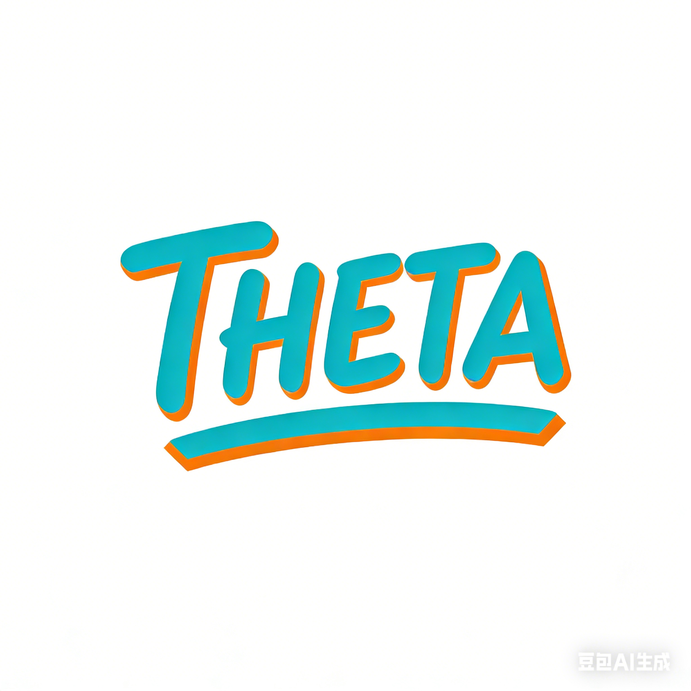

<div align="center">



<h1>THETA (θ)</h1>

基于文本混合嵌入的主题分析  
Textual Hybrid Embedding–based Topic Analysis

</div>

**[English](README.md) | [中文](README_CN.md)**

## 概述

THETA (θ) 是一个面向研究的开源平台，用于社会科学领域的 LLM 增强主题分析。它结合了：

- 来自统一基础模型（如 Qwen-3）的领域自适应文档嵌入
  - 零样本嵌入（无需训练），或
  - LoRA 适配器（轻量级、模块化的领域微调）
- 生成式主题模型
  - ETM（嵌入主题模型），用于生成连贯且可解释的主题
  - DETM（动态 ETM），用于主题随时间演化
- 通过内在指标（连贯性/困惑度）和下游任务进行科学验证
- 基于代理的编排，使非技术研究人员也能轻松使用工作流程

THETA 旨在将主题建模从"带有漂亮图表的聚类"转变为可重复、可验证的科学工作流程。

---

## 核心特性

- 混合嵌入主题分析（零样本 / LoRA）
- 用于多领域的 LoRA"专家适配器"（即插即用）
- 使用 ETM/DETM 的生成式主题建模，具备可解释性和稳定性
- 细粒度、领域感知的数据治理（隐私掩码规范化、表情符号转文本、元数据剥离）
- 验证层：连贯性/困惑度和下游任务指标（F1/AUC）
- 基于代理的交互式平台（数据管理员 → 建模分析师 → 领域专家 → 解释性报告）

---

## 方法概述

THETA 遵循六层流程：

1. **数据源与治理**：数据摄取、去标识化、噪声去除、数据集特定的清洗规则
2. **语义增强**：基础模型嵌入（零样本或 LoRA）以获得领域自适应向量
3. **深度结构挖掘**：ETM/DETM 作为主要主题主干（可选 UMAP/HDBSCAN 进行基线探索）
4. **验证**：内在指标 + 下游任务
5. **代理平台**：编排、参数调优、报告生成
6. **解释性报告**：主题地图、层次结构、趋势叙述

---

## 系统要求

- Python 3.10+
- CUDA 为可选，但建议用于 LoRA 训练和大规模嵌入
- 典型依赖：PyTorch、Transformers、PEFT、数据集工具、ETM/DETM 实现、评估和可视化工具、用于应用的 Streamlit 或 Gradio

---

## 安装

```bash
git clone https://github.com/<YOUR_ORG>/THETA.git
cd THETA

pip install -r requirements.txt
# 或
pip install -e .
```

---

## 快速开始

以下命令为模板。请将模块路径/CLI 名称替换为您的实际实现。

### **A) 零样本模式**

```
# 1) 数据清洗与语义增强
python -m theta.clean \
  --dataset cfpb \
  --input data/raw/cfpb.csv \
  --output data/processed/cfpb.jsonl

# 2) 生成嵌入（零样本）
python -m theta.embed \
  --model Qwen3 \
  --mode zeroshot \
  --input data/processed/cfpb.jsonl \
  --output artifacts/embeddings/cfpb.npy

# 3) 训练 ETM（或 DETM）
python -m theta.topic \
  --method etm \
  --embeddings artifacts/embeddings/cfpb.npy \
  --texts data/processed/cfpb.jsonl \
  --output artifacts/topics/cfpb_etm
```

### **B) LoRA 模式**

```
# 1) 训练领域 LoRA 适配器（根据您的设置使用 MLM/CLM）
python -m theta.train_lora \
  --base Qwen3 \
  --dataset cfpb \
  --output adapters/adapter_finance

# 2) 使用 LoRA 适配器生成嵌入
python -m theta.embed \
  --model Qwen3 \
  --mode lora \
  --adapter adapters/adapter_finance \
  --input data/processed/cfpb.jsonl \
  --output artifacts/embeddings/cfpb_lora.npy

# 3) 训练 ETM/DETM
python -m theta.topic \
  --method etm \
  --embeddings artifacts/embeddings/cfpb_lora.npy \
  --texts data/processed/cfpb.jsonl \
  --output artifacts/topics/cfpb_etm_lora
```

---

## 数据治理与预处理

数据治理直接影响主题连贯性和可解释性。THETA 使用领域感知的清洗策略，在保留语义信号的同时去除扭曲主题结构的伪影。

治理策略示例：

- **金融/监管文本**（如 CFPB）
  - 将隐私掩码（如"XXXX"、"[REDACTED]"）规范化为主特殊令牌
  - 移除仅包含模板、无实质性内容的提交

- **社交媒体健康或敏感话语**（如 Reddit 心理健康、仇恨言论）
  - 避免删除表情符号和俚语；将表情符号转换为文本（如 😭 → "sadness"）
  - 在有助于语义分组时规范化缩写

- **政治转录稿**
  - 移除程序性元数据（如"掌声"、"主席干预"），同时保留政策内容

- **蜜罐/机器人语料库**
  - 剥离垃圾链接和跟踪令牌，过滤极低信息量的帖子，可选标记可疑机器人账户

治理输出：

- 标准化语料库（JSONL/CSV），已去标识化且格式对齐
- 语义增强的文本副本（表情符号转文本、规范化）
- 清洗报告（规则、移除计数、噪声类别）

---

## 语义增强（嵌入）

THETA 支持两种嵌入操作模式：

- **零样本**：使用基础模型直接嵌入文本以建立基线
- **LoRA**：加载领域适配器以生成与领域特定语义对齐的嵌入

典型嵌入产物：

- 嵌入矩阵（N x D），存储为 .npy 或 .pt
- 从行号到文档 ID 的索引映射
- 可选缓存以支持增量运行

推荐的适配器命名：

- adapters/adapter_finance
- adapters/adapter_mental_health
- adapters/adapter_politics
- adapters/adapter_hate_speech
- adapters/adapter_honeypot

---

## 深度结构挖掘（ETM/DETM）

THETA 使用 ETM 作为主要主题建模主干，在有时间戳时使用 DETM 进行动态主题演化。

典型输出：

- 文档-主题分布（theta_d）
- 主题描述符（每个主题的顶级关键词和权重）
- 用于距离地图和层次结构发现的主题嵌入
- 主题演化时间线（DETM），用于随时间趋势分析

---

## 验证与评估

THETA 将主题建模视为经过验证的科学工作流程。

内在评估：

- 主题连贯性（如 C_v）
- 困惑度
- 可选稳定性检查（跨种子/引导）

下游验证示例：

- **金融风险检测**：早期发现非法收集或隐藏费用主题；基于趋势的预警
- **自杀意念检测**：主题衍生的风险因素改进分类器 F1/AUC
- **公众舆论分析**：将粗粒度情感分解为细粒度主题；将主题流行度与外部指标关联
- **机器人/脚本挖掘**：聚类模板化叙述和链接密集型垃圾邮件模式
- **政治话语**：跟踪与事件或政策周期对齐的主题转变

---

## 基于代理的平台

THETA 可以部署为具有三个核心代理的交互式应用：

- **数据管理员**：选择清洗策略并运行治理脚本
- **建模分析师**：选择嵌入模式，运行 ETM/DETM，使用指标调优超参数
- **领域专家**：基于主题和可选知识库生成解释性报告

示例命令：

```
streamlit run apps/streamlit_app.py
# 或
python apps/gradio_app.py
```

---

## 配置

建议使用基于 YAML 的配置：

```
model:
  base: "Qwen3"
  embedding_mode: "lora"
  adapter_path: "adapters/adapter_finance"

topic:
  method: "etm"
  num_topics: 50
  epochs: 200
  batch_size: 256

data:
  dataset: "cfpb"
  input_path: "data/processed/cfpb.jsonl"
  text_field: "text"
  id_field: "id"
```

运行：

```
python -m theta.run --config configs/default.yaml
```

---

## 基线

推荐的比较基线：

- LDA
- TF-IDF + KMeans/HDBSCAN
- 零样本嵌入 vs LoRA 适配嵌入（核心消融）
- 可选 BERTopic 风格的管道进行额外比较

---

## 📊 项目进度

### ✅ 已完成任务

#### 数据预处理
- ✅ **数据清洗模块** `Completed by: pjq`
  - dataclean 文件夹已上传
  - 准备进行模型训练

#### 文档与设计
- ✅ **README 完善** `Completed by: 李国正`
  - 添加待办事项统计
  - 添加中文版本 (README_CN.md)
  - 添加详细路线图和任务分配

- ✅ **前端 Demo 设计** `Completed by: 李国正`
  - 前端 Demo 1: [http://theta-frontend1.neovurge.com/](http://theta-frontend1.neovurge.com/)
  - 前端 Demo 2: [http://theta-frontend2.neovurge.com/](http://theta-frontend2.neovurge.com/)
  - 重新设计前端界面，优化用户体验

- ✅ **项目知识库** `Completed by: 李国正`
  - NotebookLM 项目知识库已建立
  - 链接: [https://notebooklm.google.com/notebook/7af619ee-678c-4e9d-af89-482342b83e95](https://notebooklm.google.com/notebook/7af619ee-678c-4e9d-af89-482342b83e95)

### 🔄 进行中

- 🔄 **模型训练准备** `In Progress: pjq`
  - 数据清洗模块已完成
  - 计划明天开始模型训练

- 🔄 **前端页面功能完善** `In Progress: 李国正` `Date: 今日`
  - 重点优化 analytics、rag、setup 页面
  - 集成 API 数据加载与错误处理
  - 更新 layout 配置
  - 新增依赖包
  - 编写后端实现清单（包含接口规范、待办内容等）

---

## 路线图

### 📅 近期冲刺 (Sprint DDL: 1.14)

#### 🚀 核心数据链路 (Data Pipeline & NLP)

* [ ] **标准化预处理 Pipeline** `Assignee: pjq` `DDL: 1.14`
  * [ ] 实现数据清洗、预处理、分词等全流程。
  * [ ] 封装为标准化模块，确保后续产品上线可用。

* [ ] **模型训练与数据保存** `Assignee: pjq` `DDL: 1.14`
  * [ ] 将 Embedding 输入 Topic Model 进行训练（涵盖多个数据集）。
  * [ ] 保存模型对应的矩阵数据及绘图所需中间数据。

* [ ] **输出物预调研** `Assignee: pjq` `DDL: 1.14`
  * [ ] 确定输出的具体内容（图表类型、表格格式、计算指标）。

* [ ] **基础绘图与导出** `Assignee: pjq` `DDL: 1.14`
  * [ ] 实现基础绘图功能。
  * [ ] 实现 CSV 表格数据导出。

---

#### 🧩 功能开发与集成 (Features & Integration)

##### 📊 可视化与开源库融合 (Visualization)

* [ ] **开源绘图库集成** `Assignee: lixin`
  * [ ] 融合 `tmtoolkit` 与 `pyLDAvis` 的绘图功能。
  * [ ] **Ref:** [tmtoolkit docs](https://tmtoolkit.readthedocs.io/en/latest/topic_modeling.html), [pyLDAvis repo](https://github.com/bmabey/pyLDAvis).
  * [ ] 与核心数据链路（pjq 负责部分）进行对接。

* [ ] **新数据适配** `Assignee: pjq`
  * [ ] 确保 Pipeline 能够处理新输入的数据。

##### 🤖 AI Agent & 分析模块 (Analysis Agent)

* [ ] **图表/数据分析 Agent 开发** `Assignee: pjq, lixin`
  * [ ] 技术栈：`LangGraph` / `LangChain`。
  * [ ] 功能：对生成的图/表进行单次分析（无需多轮对话）。
  * [ ] **重点**：Prompt Engineering（提示词工程）。
  * [ ] 接口：可能涉及多模态 API 调用。

* [ ] **Agent 基础架构** `Assignee: 李芳痕`
  * [ ] 搭建 Agent 基础框架。

* [ ] **对话记录存储** `Assignee: pjq`
  * [ ] 实现对话记录上云存储。

* [ ] **解读功能补充** `Assignee: 李国正` `Priority: Low`
  * [ ] (如有时间) 辅助开发 Agent 解读功能。

##### 🔌 后端与接口 (Backend & API)

* [ ] **Format-free 数据接口** `Assignee: 李芳痕`
  * [ ] 开发支持多种格式输入的灵活接口。

* [ ] **脚本化执行接口** `Assignee: pjq`
  * [ ] 实现类 Bash 方式的调用接口（从前端接收参数 -> 触发绘图/分析代码）。

---

#### 💻 产品与前端对接 (Product & Frontend)

* [ ] **产品设计** `Assignee: 李国正`
  * [ ] 确定产品整体功能与交互流程。

* [ ] **需求文档编写** `Assignee: lixin`
  * [ ] 整理详细的功能需求文档。

* [ ] **前后端对接与集成** `Assignee: 李国正, pjq`
  * [ ] 页面设计完成后的前端联调。
  * [ ] 产品级的前后端逻辑打通。

---

### 📋 长期路线图

- **v0.1**：统一数据集接口 + 零样本嵌入 + ETM 基线
- **v0.2**：LoRA 适配器训练管道 + 连贯性/困惑度报告
- **v0.3**：DETM 主题演化 + 交互式可视化
- **v0.4**：基于代理的一键分析 + 可导出报告
- **v1.0**：可重复的基准测试套件（数据集、基线、下游任务）

---

## 引用

```
@software{theta_topic_analysis,
  title  = {THETA (θ): Textual Hybrid Embedding--based Topic Analysis},
  author = {TODO: Your Name},
  year   = {2026}
}
```

---

## 许可证

请选择一个并添加到 LICENSE：

- Apache-2.0
- MIT

---

## 贡献

欢迎贡献，包括：

- 新数据集适配器
- 主题可视化模块
- 评估和可重复性脚本
- 代理工具和报告模板

建议工作流程：

1. Fork 仓库并创建功能分支
2. 添加最小可复现示例或测试
3. 提交 Pull Request

---

## 伦理与安全

本项目分析社会文本，可能涉及敏感内容。

- 不要包含个人可识别信息（PII）
- 确保数据集使用符合平台条款和研究伦理
- 谨慎解释输出；主题发现不能替代科学结论
- 在敏感领域（如自残、仇恨言论、政治极化）负责任地使用

---

## 常见问题

**Q: 这只能用于 Qwen-3 吗？**

A: 不是。Qwen-3 是参考主干，但 THETA 设计为模型无关。

**Q: ETM 和 DETM 有什么区别？**

A: ETM 学习整个语料库的静态主题；DETM 建模主题随时间的演化，需要时间戳或时间箱。

**Q: 我可以添加自己的数据集吗？**

A: 可以。导出标准化的 JSONL，至少包含 id 和 text 字段，并实现数据集适配器。

---

## 联系我们

如有任何问题，请通过以下邮箱联系我们：duanzhenke@stu.zuel.edu.cn、panjiqun@stu.zuel.edu.cn 或 lixin@stu.zuel.edu.cn。
