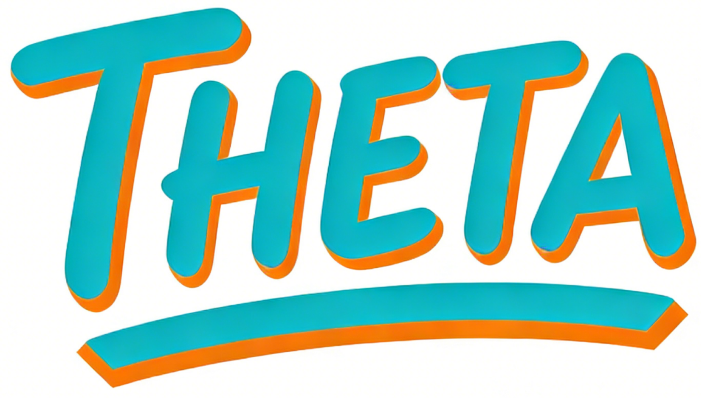

<div align="center">



<h1>THETA (θ)</h1>

[](https://theta.code-soul.com/)
[](https://huggingface.co/CodeSoulco/THETA)
[](https://arxiv.org/abs/2603.05972)

[English](README.md) | **中文**

基于文本混合嵌入的主题分析  

</div>

## 概述

THETA (θ) 是一个面向社会科学中大语言模型增强主题分析的开源研究平台。它结合了：

- 来自通义千问-3模型（0.6B/4B/8B）的领域自适应文档嵌入
  - 零样本嵌入（无需训练），或
  - 有监督/无监督微调模式
- 生成式主题模型，包含12个用于比较的基线模型：
  - **THETA**：使用通义千问嵌入的主模型（0.6B/4B/8B）
  - **传统模型**：LDA、HDP（自动主题数）、STM（需要协变量）、BTM（短文本）
  - **神经模型**：ETM、CTM、DTM（时间感知）、NVDM、GSM、ProdLDA、BERTopic
- 通过7项内在指标进行科学验证（PPL、TD、iRBO、NPMI、C_V、UMass、Exclusivity）
- 全面的可视化，支持双语（英文/中文）

THETA旨在将主题建模从"带有漂亮图表的聚类"转变为可重复、经过验证的科学工作流程。

---

## 主要特点

- **混合嵌入主题分析**：零样本 / 有监督 / 无监督模式
- **多种通义千问模型规模**：0.6B（1024维）、4B（2560维）、8B（4096维）
- **12个基线模型**：LDA、HDP、STM（需要协变量）、BTM、ETM、CTM、DTM、NVDM、GSM、ProdLDA、BERTopic用于比较
- **数据治理**：针对多种语言（英语、中文、德语、西班牙语）的领域感知清洗
- **统一评估**：7项指标，支持JSON/CSV导出
- **丰富的可视化**：20+种图表类型，带有双语标签

---

## 支持的模型

### 模型概览

| 模型 | 类型 | 描述 | 自动主题数 | 最佳适用场景 |
|-------|------|-------------|-------------|----------|
| `theta` | 神经模型 | 使用通义千问嵌入的THETA模型（0.6B/4B/8B） | 否 | 通用目的，高质量 |
| `lda` | 传统模型 | 潜在狄利克雷分配（sklearn） | 否 | 快速基线，可解释性强 |
| `hdp` | 传统模型 | 层次狄利克雷过程 | **是** | 主题数量未知 |
| `stm` | 传统模型 | 结构主题模型 | 否 | **需要协变量**（元数据） |
| `btm` | 传统模型 | 双词主题模型 | 否 | 短文本（推文、标题） |
| `etm` | 神经模型 | 嵌入主题模型（Word2Vec + VAE） | 否 | 词嵌入集成 |
| `ctm` | 神经模型 | 上下文主题模型（SBERT + VAE） | 否 | 语义理解 |
| `dtm` | 神经模型 | 动态主题模型 | 否 | 时间序列分析 |
| `nvdm` | 神经模型 | 神经变分文档模型 | 否 | 基于VAE的基线 |
| `gsm` | 神经模型 | 高斯Softmax模型 | 否 | 更好的主题分离 |
| `prodlda` | 神经模型 | 专家乘积LDA | 否 | 最先进的神经LDA |
| `bertopic` | 神经模型 | 基于BERT的主题建模 | **是** | 基于聚类的主题 |

### 模型选择指南

```
根据以下条件选择模型：

┌─────────────────────────────────────────────────────────────────┐
│ 您知道主题数量吗？                                               │
│   ├─ 否  → 使用 HDP 或 BERTopic（自动检测主题数）               │
│   └─ 是 → 继续往下看                                             │
├─────────────────────────────────────────────────────────────────┤
│ 您的文本长度如何？                                               │
│   ├─ 短文本（推文、标题） → 使用 BTM                            │
│   └─ 正常/长文本 → 继续往下看                                   │
├─────────────────────────────────────────────────────────────────┤
│ 您有文档级别的元数据（协变量）吗？                               │
│   ├─ 是 → 使用 STM（建模元数据如何影响主题）                     │
│   └─ 否  → 继续往下看                                            │
├─────────────────────────────────────────────────────────────────┤
│ 您有时间序列数据吗？                                             │
│   ├─ 是 → 使用 DTM                                               │
│   └─ 否  → 继续往下看                                            │
├─────────────────────────────────────────────────────────────────┤
│ 您的优先考虑是什么？                                             │
│   ├─ 速度      → 使用 LDA（最快）                               │
│   ├─ 质量      → 使用 THETA（通义千问嵌入效果最佳）             │
│   └─ 比较研究 → 使用多个模型：lda,nvdm,prodlda,theta            │
└─────────────────────────────────────────────────────────────────┘
```


### 训练参数参考

#### THETA参数

| 参数              | 类型  | 默认值      | 范围                                      | 描述            |
| ----------------- | ----- | ----------- | ----------------------------------------- | --------------- |
| `--model_size`    | str   | `0.6B`      | `0.6B`, `4B`, `8B`                        | Qwen模型规格    |
| `--mode`          | str   | `zero_shot` | `zero_shot`, `supervised`, `unsupervised` | 嵌入模式        |
| `--num_topics`    | int   | 20          | 5–100                                     | 主题数 K        |
| `--num_layers`    | int   | 2           | 1–5                                       | 编码器隐藏层数  |
| `--hidden_dim`    | int   | 512         | 128–2048                                  | 每层神经元数    |
| `--epochs`        | int   | 100         | 10–500                                    | 训练轮数        |
| `--batch_size`    | int   | 64          | 8–512                                     | 批大小          |
| `--learning_rate` | float | 0.002       | 1e-5–0.1                                  | 学习率          |
| `--dropout`       | float | 0.2         | 0–0.9                                     | 编码器Dropout率 |
| `--kl_start`      | float | 0.0         | 0–1                                       | KL退火起始权重  |
| `--kl_end`        | float | 1.0         | 0–1                                       | KL退火终止权重  |
| `--kl_warmup`     | int   | 50          | 0–epochs                                  | KL预热轮数      |
| `--patience`      | int   | 10          | 1–50                                      | 早停耐心轮数    |
| `--language`      | str   | `en`        | `en`, `zh`                                | 可视化语言      |

#### 基线模型参数

**LDA**

| 参数           | 类型  | 默认值      | 范围       | 描述                  |
| -------------- | ----- | ----------- | ---------- | --------------------- |
| `--num_topics` | int   | 20          | 5–100      | 主题数 K              |
| `--max_iter`   | int   | 100         | 10–500     | 最大EM迭代次数        |
| `--alpha`      | float | 自动（1/K） | >0         | 文档-主题狄利克雷先验 |
| `--vocab_size` | int   | 5000        | 1000–20000 | 词表大小              |

**HDP**

| 参数           | 类型  | 默认值 | 范围       | 描述           |
| -------------- | ----- | ------ | ---------- | -------------- |
| `--max_topics` | int   | 150    | 50–300     | 主题数上限     |
| `--alpha`      | float | 1.0    | >0         | 文档级集中参数 |
| `--vocab_size` | int   | 5000   | 1000–20000 | 词表大小       |

**STM**

| 参数           | 类型 | 默认值 | 范围       | 描述           |
| -------------- | ---- | ------ | ---------- | -------------- |
| `--num_topics` | int  | 20     | 5–100      | 主题数 K       |
| `--max_iter`   | int  | 100    | 10–500     | 最大EM迭代次数 |
| `--vocab_size` | int  | 5000   | 1000–20000 | 词表大小       |

**BTM**

| 参数           | 类型  | 默认值 | 范围       | 描述                 |
| -------------- | ----- | ------ | ---------- | -------------------- |
| `--num_topics` | int   | 20     | 5–100      | 主题数 K             |
| `--n_iter`     | int   | 100    | 10–500     | Gibbs采样迭代次数    |
| `--alpha`      | float | 1.0    | >0         | 主题分布狄利克雷先验 |
| `--beta`       | float | 0.01   | >0         | 词分布狄利克雷先验   |
| `--vocab_size` | int   | 5000   | 1000–20000 | 词表大小             |

**ETM**

| 参数              | 类型  | 默认值 | 范围       | 描述                   |
| ----------------- | ----- | ------ | ---------- | ---------------------- |
| `--num_topics`    | int   | 20     | 5–100      | 主题数 K               |
| `--num_layers`    | int   | 2      | 1–5        | 编码器隐藏层数         |
| `--hidden_dim`    | int   | 800    | 128–2048   | 每层神经元数           |
| `--embedding_dim` | int   | 300    | 50–1024    | 词向量维度（Word2Vec） |
| `--epochs`        | int   | 100    | 10–500     | 训练轮数               |
| `--batch_size`    | int   | 64     | 8–512      | 批大小                 |
| `--learning_rate` | float | 0.002  | 1e-5–0.1   | 学习率                 |
| `--dropout`       | float | 0.5    | 0–0.9      | Dropout率              |
| `--vocab_size`    | int   | 5000   | 1000–20000 | 词表大小               |

**CTM**

| 参数               | 类型  | 默认值     | 范围                   | 描述                                            |
| ------------------ | ----- | ---------- | ---------------------- | ----------------------------------------------- |
| `--num_topics`     | int   | 20         | 5–100                  | 主题数 K                                        |
| `--inference_type` | str   | `zeroshot` | `zeroshot`, `combined` | `zeroshot`（仅SBERT）或 `combined`（SBERT+BOW） |
| `--num_layers`     | int   | 2          | 1–5                    | 编码器隐藏层数                                  |
| `--hidden_dim`     | int   | 100        | 32–1024                | 每层神经元数                                    |
| `--epochs`         | int   | 100        | 10–500                 | 训练轮数                                        |
| `--batch_size`     | int   | 64         | 8–512                  | 批大小                                          |
| `--learning_rate`  | float | 0.002      | 1e-5–0.1               | 学习率                                          |
| `--dropout`        | float | 0.2        | 0–0.9                  | Dropout率                                       |
| `--vocab_size`     | int   | 5000       | 1000–20000             | 词表大小                                        |

**DTM**

| 参数              | 类型  | 默认值 | 范围       | 描述           |
| ----------------- | ----- | ------ | ---------- | -------------- |
| `--num_topics`    | int   | 20     | 5–100      | 主题数 K       |
| `--num_layers`    | int   | 2      | 1–5        | 编码器隐藏层数 |
| `--hidden_dim`    | int   | 512    | 128–2048   | 每层神经元数   |
| `--epochs`        | int   | 100    | 10–500     | 训练轮数       |
| `--batch_size`    | int   | 64     | 8–512      | 批大小         |
| `--learning_rate` | float | 0.002  | 1e-5–0.1   | 学习率         |
| `--dropout`       | float | 0.2    | 0–0.9      | Dropout率      |
| `--vocab_size`    | int   | 5000   | 1000–20000 | 词表大小       |

**NVDM / GSM / ProdLDA**

| 参数              | 类型  | 默认值 | 范围       | 描述           |
| ----------------- | ----- | ------ | ---------- | -------------- |
| `--num_topics`    | int   | 20     | 5–100      | 主题数 K       |
| `--num_layers`    | int   | 2      | 1–5        | 编码器隐藏层数 |
| `--hidden_dim`    | int   | 256    | 128–2048   | 每层神经元数   |
| `--epochs`        | int   | 100    | 10–500     | 训练轮数       |
| `--batch_size`    | int   | 64     | 8–512      | 批大小         |
| `--learning_rate` | float | 0.002  | 1e-5–0.1   | 学习率         |
| `--dropout`       | float | 0.2    | 0–0.9      | Dropout率      |
| `--vocab_size`    | int   | 5000   | 1000–20000 | 词表大小       |

**BERTopic**

| 参数                 | 类型 | 默认值 | 范围         | 描述                                 |
| -------------------- | ---- | ------ | ------------ | ------------------------------------ |
| `--num_topics`       | int  | 自动   | ≥2 或 `None` | 目标主题数；`None` 表示自动检测      |
| `--min_cluster_size` | int  | 10     | 2–100        | 最小簇大小，控制主题粒度             |
| `--top_n_words`      | int  | 10     | 1–30         | 每个主题展示的词数                   |
| `--n_neighbors`      | int  | 15     | 2–100        | UMAP近邻数，控制局部与全局结构的平衡 |
| `--n_components`     | int  | 5      | 2–50         | UMAP降维后的维度数                   |

---

## 项目结构

```
/root/
├── ETM/                          # 主代码库
│   ├── run_pipeline.py           # 统一入口点
│   ├── prepare_data.py           # 数据预处理
│   ├── config.py                 # 配置管理
│   ├── dataclean/                # 数据清洗模块
│   ├── model/                    # 模型实现
│   │   ├── theta/                # THETA主模型
│   │   ├── baselines/            # 12个基线模型
│   │   └── _reference/           # 参考实现
│   ├── evaluation/               # 评估指标
│   ├── visualization/            # 可视化工具
│   └── utils/                    # 工具函数
├── agent/                        # 智能体系统
│   ├── api.py                    # FastAPI端点
│   ├── core/                     # 智能体实现
│   ├── config/                   # 配置管理
│   ├── prompts/                  # 提示词模板
│   ├── utils/                    # LLM和视觉工具
│   └── docs/                     # API文档
├── scripts/                      # 自动化Shell脚本
├── embedding/                    # 通义千问嵌入生成
│   ├── main.py                   # 嵌入生成主代码
│   ├── embedder.py               # 嵌入器
│   ├── trainer.py                # 训练（有监督/无监督）
│   ├── data_loader.py            # 数据加载器
```

---

## 环境要求

- Python 3.10+
- 推荐使用CUDA进行GPU加速
- 主要依赖：

```
numpy>=1.20.0
scipy>=1.7.0
torch>=1.10.0
transformers>=4.30.0
pandas>=1.3.0
matplotlib>=3.4.0
seaborn>=0.11.0
scikit-learn>=1.0.0
gensim>=4.1.0
wordcloud>=1.8.0
pyLDAvis>=3.3.0
jieba>=0.42.0
```

---

## 安装

```bash
git clone https://github.com/<您的组织>/THETA.git
cd THETA

# 安装依赖
pip install -r ETM/requirements.txt

# 或使用设置脚本
bash scripts/01_setup.sh
```

### 从HuggingFace获取预训练数据

如果本地没有预训练的嵌入和词袋数据，请从HuggingFace下载：

**仓库地址**：[https://huggingface.co/CodeSoulco/THETA](https://huggingface.co/CodeSoulco/THETA)

```bash
# 下载预训练数据和LoRA权重
bash scripts/09_download_from_hf.sh

# 或使用Python手动下载
python -c "
from huggingface_hub import snapshot_download
snapshot_download(
    repo_id='CodeSoulco/THETA',
    local_dir='/root/autodl-tmp/hf_cache/THETA'
)
"
```

HuggingFace仓库包含：
- 基准数据集的预计算嵌入
- 词袋矩阵和词汇表
- LoRA微调权重（可选）

---

## Shell脚本

所有脚本均为**非交互式**（纯命令行参数），适用于DLC/批处理环境。无需标准输入：

| 脚本 | 描述 |
|--------|-------------|
| `01_setup.sh` | 安装依赖并从HuggingFace下载数据 |
| `02_clean_data.sh` | 清洗原始文本数据（分词、停用词去除、词形还原） |
| `02_generate_embeddings.sh` | 生成通义千问嵌入（03的子脚本，用于失败恢复） |
| `03_prepare_data.sh` | 一站式数据准备：为所有12个模型生成词袋+嵌入 |
| `04_train_theta.sh` | 训练THETA模型（训练+评估+可视化一体化） |
| `05_train_baseline.sh` | 训练11个基线模型与THETA进行比较 |
| `06_visualize.sh` | 为已训练模型生成可视化 |
| `07_evaluate.sh` | 使用7个统一指标进行独立评估 |
| `08_compare_models.sh` | 跨模型指标比较表 |
| `09_download_from_hf.sh` | 从HuggingFace下载预训练数据 |
| `10_quick_start_english.sh` | 英文数据集快速入门 |
| `11_quick_start_chinese.sh` | 中文数据集快速入门 |
| `12_train_multi_gpu.sh` | 使用DistributedDataParallel进行多GPU训练 |
| `13_test_agent.sh` | 测试LLM智能体连接和功能 |
| `14_start_agent_api.sh` | 启动智能体API服务器（FastAPI） |

---

## 快速入门

### 快速启动（单命令）

```bash
# 英文数据集 — 一站式数据准备 + THETA训练
bash scripts/10_quick_start_english.sh my_dataset

# 中文数据集 — 一站式数据准备 + THETA训练（中文可视化）
bash scripts/11_quick_start_chinese.sh my_chinese_dataset
```

### 端到端流程（逐步执行）

```bash
# 步骤1：安装依赖
bash scripts/01_setup.sh

# 步骤2：清洗原始数据（先预览列，然后用明确的文本列进行清洗）
bash scripts/02_clean_data.sh --input data/edu_data/edu_data_raw.csv --preview
bash scripts/02_clean_data.sh --input data/edu_data/edu_data_raw.csv --language chinese --text_column cleaned_content

# 步骤3：准备数据（词袋 + 嵌入）
bash scripts/03_prepare_data.sh --dataset edu_data --model theta --model_size 0.6B --mode zero_shot --vocab_size 3500

# 步骤4：训练THETA
bash scripts/04_train_theta.sh --dataset edu_data --model_size 0.6B --mode zero_shot --num_topics 20 --language zh

# 步骤5：训练基线模型进行比较
bash scripts/05_train_baseline.sh --dataset edu_data --models lda,prodlda,etm --num_topics 20 --epochs 100

# 步骤6：比较所有模型
bash scripts/08_compare_models.sh --dataset edu_data --models lda,prodlda,etm --num_topics 20
```

---

## 详细脚本使用方法

### A) 数据清洗 — `02_clean_data.sh`

逐行文本清洗，用户指定列选择。两种模式：
- **CSV模式**：用户指定`--text_column`（需清洗的列）和`--label_columns`（保留原样的列）
- **目录模式**：将docx/txt文件转换为单个清洗后的CSV文件

**支持的语言**：`english`、`chinese`、`german`、`spanish`

```bash
# 1. 预览列（CSV格式推荐的第一步）
bash scripts/02_clean_data.sh \
    --input data/FCPB/complaints_text_only.csv --preview

# 2. 仅清洗文本列
bash scripts/02_clean_data.sh \
    --input data/FCPB/complaints_text_only.csv \
    --language english \
    --text_column 'Consumer complaint narrative'

# 3. 清洗文本 + 保留标签列
bash scripts/02_clean_data.sh \
    --input data/hatespeech/hatespeech_text_only.csv \
    --language english \
    --text_column cleaned_content --label_columns Label

# 4. 保留所有列，仅清洗文本列
bash scripts/02_clean_data.sh \
    --input raw.csv --language english \
    --text_column text --keep_all

# 5. 目录模式（docx/txt → CSV）
bash scripts/02_clean_data.sh \
    --input data/edu_data/ --language chinese
```

| 参数 | 必需 | 描述 | 默认值 |
|-----------|----------|-------------|---------|
| `--input` | ✓ | 输入的CSV文件或目录（docx/txt） | - |
| `--language` | ✓（预览模式不适用） | 数据语言：english, chinese, german, spanish | - |
| `--text_column` | ✓（CSV模式） | 需要清洗的文本列名 | - |
| `--label_columns` | | 需要原样保留的标签/元数据列，逗号分隔 | - |
| `--keep_all` | | 保留所有原始列（仅清洗文本列） | false |
| `--preview` | | 显示CSV列和示例行后退出 | false |
| `--output` | | 输出CSV路径 | 自动生成 |
| `--min_words` | | 清洗后每个文档的最小词数 | 3 |

**输出**：`data/{数据集}/{数据集}_cleaned.csv`

### B) 数据准备 — `03_prepare_data.sh`

为所有12个模型提供一站式数据准备。生成词袋矩阵和特定模型的嵌入。

**各模型的数据需求**：

| 模型 | 类型 | 所需数据 |
|-------|------|-------------|
| lda, hdp, btm | 传统模型 | 仅词袋 |
| stm | 传统模型 | 词袋 + 协变量（文档元数据） |
| nvdm, gsm, prodlda | 神经模型 | 仅词袋 |
| etm | 神经模型 | 词袋 + Word2Vec |
| ctm | 神经模型 | 词袋 + SBERT |
| dtm | 神经模型 | 词袋 + SBERT + 时间切片 |
| bertopic | 神经模型 | SBERT + 原始文本 |
| theta | THETA模型 | 词袋 + 通义千问嵌入 |

> **注意**：模型1-7（仅需词袋）共享相同的数据实验。准备一次，训练所有。

```bash
# ---- 基线模型 ----

# 仅需词袋的模型（lda, hdp, btm, nvdm, gsm, prodlda共享此数据）
bash scripts/03_prepare_data.sh \
    --dataset edu_data --model lda --vocab_size 3500 --language chinese

# CTM（词袋 + SBERT嵌入）
bash scripts/03_prepare_data.sh \
    --dataset edu_data --model ctm --vocab_size 3500 --language chinese

# ETM（词袋 + Word2Vec嵌入）
bash scripts/03_prepare_data.sh \
    --dataset edu_data --model etm --vocab_size 3500 --language chinese

# DTM（词袋 + SBERT + 时间切片，需要时间列）
bash scripts/03_prepare_data.sh \
    --dataset edu_data --model dtm --vocab_size 3500 --language chinese --time_column year

# BERTopic（SBERT + 原始文本）
bash scripts/03_prepare_data.sh \
    --dataset edu_data --model bertopic --vocab_size 3500 --language chinese

# ---- THETA模型 ----

# 零样本（最快，无需训练）
bash scripts/03_prepare_data.sh \
    --dataset edu_data --model theta --model_size 0.6B --mode zero_shot \
    --vocab_size 3500 --language chinese

# 无监督（LoRA微调通义千问嵌入）
bash scripts/03_prepare_data.sh \
    --dataset edu_data --model theta --model_size 0.6B --mode unsupervised \
    --vocab_size 3500 --language chinese

# 有监督（需要标签列）
bash scripts/03_prepare_data.sh \
    --dataset edu_data --model theta --model_size 0.6B --mode supervised \
    --vocab_size 3500 --language chinese

# ---- 高级选项 ----

# 仅生成词袋（跳过嵌入生成）
bash scripts/03_prepare_data.sh --dataset mydata --model theta --bow-only --vocab_size 5000

# 检查数据文件是否已存在
bash scripts/03_prepare_data.sh --dataset mydata --model theta --check-only

# 自定义词汇表大小和最大序列长度
bash scripts/03_prepare_data.sh --dataset mydata \
    --model theta --model_size 0.6B --mode zero_shot \
    --vocab_size 10000 --batch_size 64 --gpu 0
```

| 参数 | 必需 | 描述 | 默认值 |
|-----------|----------|-------------|---------|
| `--dataset` | ✓ | 数据集名称 | - |
| `--model` | ✓ | 目标模型：lda, hdp, stm（需要协变量）, btm, nvdm, gsm, prodlda, ctm, etm, dtm, bertopic, theta | - |
| `--model_size` | | 通义千问模型规模（仅theta）：0.6B, 4B, 8B | 0.6B |
| `--mode` | | 嵌入模式（仅theta）：zero_shot, unsupervised, supervised | zero_shot |
| `--vocab_size` | | 词汇表大小 | 5000 |
| `--batch_size` | | 嵌入生成批大小 | 32 |
| `--gpu` | | GPU设备ID | 0 |
| `--language` | | 数据语言：english, chinese（控制分词） | english |
| `--bow-only` | | 仅生成词袋，跳过嵌入 | false |
| `--check-only` | | 仅检查文件是否存在 | false |
| `--time_column` | | 时间列名（仅DTM） | year |
| `--label_column` | | 标签列（仅theta有监督模式） | - |
| `--emb_epochs` | | 嵌入微调轮数（仅theta） | 10 |
| `--emb_batch_size` | | 嵌入微调批大小（仅theta） | 8 |
| `--exp_name` | | 实验名称标签 | 自动生成 |

**嵌入恢复** — 如果嵌入生成失败（如内存不足），可仅重新运行嵌入步骤：

```bash
bash scripts/02_generate_embeddings.sh \
    --dataset edu_data --mode zero_shot --model_size 0.6B \
    --batch_size 4 --exp_dir result/0.6B/edu_data/data/exp_xxx
```

### C) THETA模型训练 — `04_train_theta.sh`

训练THETA模型，集成了训练+评估+可视化。

```bash
# ---- 基本用法 ----

# 零样本模式（最简单的命令）
bash scripts/04_train_theta.sh \
    --dataset edu_data --model_size 0.6B --mode zero_shot --num_topics 20

# 无监督模式
bash scripts/04_train_theta.sh \
    --dataset edu_data --model_size 0.6B --mode unsupervised --num_topics 20

# 有监督模式（需要标签列）
bash scripts/04_train_theta.sh \
    --dataset hatespeech --model_size 0.6B --mode supervised --num_topics 20

# 使用更大模型以获得更好质量
bash scripts/04_train_theta.sh \
    --dataset hatespeech --model_size 4B --mode zero_shot --num_topics 20

# ---- 完整参数 ----

bash scripts/04_train_theta.sh \
    --dataset edu_data --model_size 0.6B --mode zero_shot \
    --num_topics 20 --epochs 100 --batch_size 64 \
    --hidden_dim 512 --learning_rate 0.002 \
    --kl_start 0.0 --kl_end 1.0 --kl_warmup 50 \
    --patience 10 --gpu 0 --language zh

# 自定义KL退火
bash scripts/04_train_theta.sh \
    --dataset hatespeech --model_size 0.6B --mode zero_shot \
    --num_topics 20 --epochs 200 \
    --kl_start 0.1 --kl_end 0.8 --kl_warmup 40

# ---- 指定数据实验 ----

# 使用特定的预处理数据实验
bash scripts/04_train_theta.sh \
    --dataset edu_data --model_size 0.6B --mode zero_shot \
    --data_exp exp_20260208_151906_vocab3500_theta_0.6B_zero_shot \
    --num_topics 20 --epochs 50 --language zh

# ---- 跳过选项 ----

# 跳过可视化（仅训练+评估，更快）
bash scripts/04_train_theta.sh \
    --dataset edu_data --model_size 0.6B --mode zero_shot \
    --num_topics 20 --skip-viz

# 跳过训练（评估+可视化现有模型）
bash scripts/04_train_theta.sh \
    --dataset edu_data --model_size 0.6B --mode zero_shot \
    --skip-train --language zh
```

| 参数 | 必需 | 描述 | 默认值 |
|-----------|----------|-------------|---------|
| `--dataset` | ✓ | 数据集名称 | - |
| `--model_size` | | 通义千问模型规模：0.6B, 4B, 8B | 0.6B |
| `--mode` | | 嵌入模式：zero_shot, unsupervised, supervised | zero_shot |
| `--num_topics` | | 主题数量K | 20 |
| `--epochs` | | 训练轮数 | 100 |
| `--batch_size` | | 训练批大小 | 64 |
| `--hidden_dim` | | 编码器隐藏层维度 | 512 |
| `--learning_rate` | | 学习率 | 0.002 |
| `--kl_start` | | KL退火起始权重 | 0.0 |
| `--kl_end` | | KL退火结束权重 | 1.0 |
| `--kl_warmup` | | KL退火轮数 | 50 |
| `--patience` | | 早停耐心值 | 10 |
| `--gpu` | | GPU设备ID | 0 |
| `--language` | | 可视化语言：en, zh | en |
| `--skip-train` | | 跳过训练，仅评估 | false |
| `--skip-viz` | | 跳过可视化 | false |
| `--data_exp` | | 数据实验ID | 自动最新 |
| `--exp_name` | | 实验名称标签 | 自动生成 |

### D) 基线模型训练 — `05_train_baseline.sh`

训练11个基线主题模型，与THETA进行比较。

#### 支持的模型

| 模型 | 类型 | 描述 | 特定模型参数 |
|-------|------|-------------|---------------------------|
| **lda** | 传统模型 | 潜在狄利克雷分配 | `--max_iter` |
| **hdp** | 传统模型 | 层次狄利克雷过程（自动确定主题数） | `--max_topics`, `--alpha` |
| **stm** | 传统模型 | 结构主题模型（**需要协变量**） | `--max_iter` |
| **btm** | 传统模型 | 双词主题模型（最适合短文本） | `--n_iter`, `--alpha`, `--beta` |
| **nvdm** | 神经模型 | 神经变分文档模型 | `--epochs`, `--dropout` |
| **gsm** | 神经模型 | 高斯Softmax模型 | `--epochs`, `--dropout` |
| **prodlda** | 神经模型 | 专家乘积LDA | `--epochs`, `--dropout` |
| **ctm** | 神经模型 | 上下文主题模型（需要SBERT） | `--epochs`, `--inference_type` |
| **etm** | 神经模型 | 嵌入主题模型（需要Word2Vec） | `--epochs` |
| **dtm** | 神经模型 | 动态主题模型（需要时间戳） | `--epochs` |
| **bertopic** | 神经模型 | 基于BERT的主题模型（自动确定主题数） | - |

#### 各模型的完整示例

```bash
# ============================================================
# 1. LDA — 潜在狄利克雷分配
#    类型：传统模型 | 数据：仅词袋
#    特定参数：--max_iter（最大EM迭代次数）
# ============================================================

# 最小化
bash scripts/05_train_baseline.sh \
    --dataset edu_data --models lda --num_topics 20

# 完整参数
bash scripts/05_train_baseline.sh \
    --dataset edu_data --models lda \
    --num_topics 20 --max_iter 200 \
    --gpu 0 --language zh --with-viz \
    --data_exp exp_20260208_153424_vocab3500_lda \
    --exp_name lda_full

# ============================================================
# 2. HDP — 层次狄利克雷过程
#    类型：传统模型 | 数据：仅词袋
#    注意：自动确定主题数，--num_topics被忽略
#    特定参数：--max_topics, --alpha
# ============================================================

# 最小化（自动主题数）
bash scripts/05_train_baseline.sh \
    --dataset edu_data --models hdp

# 完整参数
bash scripts/05_train_baseline.sh \
    --dataset edu_data --models hdp \
    --max_topics 150 --alpha 1.0 \
    --gpu 0 --language zh --with-viz \
    --data_exp exp_20260208_153424_vocab3500_lda \
    --exp_name hdp_full

# ============================================================
# 3. STM — 结构主题模型
#    类型：传统模型 | 数据：词袋 + 协变量（文档元数据）
#    需要协变量 — 如果数据集没有元数据则自动跳过
#    特定参数：--max_iter
# ============================================================
#
# 使用STM的方法：
#   1. 确保清洗后的CSV有元数据列（如year, source, category）
#   2. 在ETM/config.py → DATASET_CONFIGS中注册协变量：
#        DATASET_CONFIGS["my_dataset"] = {
#            ...
#            "covariate_columns": ["year", "source", "category"],
#        }
#   3. 准备数据（与其他仅词袋模型相同）
#   4. 训练STM
#
# 如果没有配置协变量，您会看到：
#   [跳过] STM：STM需要文档级别的协变量（元数据）...
# 这种情况下，请改用CTM（相同的逻辑正态先验）或LDA。

# 最小化（需要在DATASET_CONFIGS中有协变量）
bash scripts/05_train_baseline.sh \
    --dataset my_dataset_with_covariates --models stm --num_topics 20

# 完整参数
bash scripts/05_train_baseline.sh \
    --dataset my_dataset_with_covariates --models stm \
    --num_topics 20 --max_iter 200 \
    --gpu 0 --language en --with-viz \
    --data_exp exp_20260208_153424_vocab3500_lda \
    --exp_name stm_full

# ============================================================
# 4. BTM — 双词主题模型
#    类型：传统模型 | 数据：仅词袋
#    注意：使用吉布斯采样，在长文档上非常慢（每个文档最多采样50个词）
#    最适合短文本（推文、评论）
#    特定参数：--n_iter, --alpha, --beta
# ============================================================

# 最小化
bash scripts/05_train_baseline.sh \
    --dataset edu_data --models btm --num_topics 20

# 完整参数
bash scripts/05_train_baseline.sh \
    --dataset edu_data --models btm \
    --num_topics 20 --n_iter 100 --alpha 1.0 --beta 0.01 \
    --gpu 0 --language zh --with-viz \
    --data_exp exp_20260208_153424_vocab3500_lda \
    --exp_name btm_full

# ============================================================
# 5. NVDM — 神经变分文档模型
#    类型：神经模型 | 数据：仅词袋
#    特定参数：--epochs, --batch_size, --hidden_dim, --learning_rate, --dropout
# ============================================================

# 最小化
bash scripts/05_train_baseline.sh \
    --dataset edu_data --models nvdm --num_topics 20

# 完整参数
bash scripts/05_train_baseline.sh \
    --dataset edu_data --models nvdm \
    --num_topics 20 --epochs 200 --batch_size 128 \
    --hidden_dim 512 --learning_rate 0.002 --dropout 0.2 \
    --gpu 0 --language zh --with-viz \
    --data_exp exp_20260208_153424_vocab3500_lda \
    --exp_name nvdm_full

# ============================================================
# 6. GSM — 高斯Softmax模型
#    类型：神经模型 | 数据：仅词袋
#    特定参数：--epochs, --batch_size, --hidden_dim, --learning_rate, --dropout
# ============================================================

# 最小化
bash scripts/05_train_baseline.sh \
    --dataset edu_data --models gsm --num_topics 20

# 完整参数
bash scripts/05_train_baseline.sh \
    --dataset edu_data --models gsm \
    --num_topics 20 --epochs 200 --batch_size 128 \
    --hidden_dim 512 --learning_rate 0.002 --dropout 0.2 \
    --gpu 0 --language zh --with-viz \
    --data_exp exp_20260208_153424_vocab3500_lda \
    --exp_name gsm_full

# ============================================================
# 7. ProdLDA — 专家乘积LDA
#    类型：神经模型 | 数据：仅词袋
#    特定参数：--epochs, --batch_size, --hidden_dim, --learning_rate, --dropout
# ============================================================

# 最小化
bash scripts/05_train_baseline.sh \
    --dataset edu_data --models prodlda --num_topics 20

# 完整参数
bash scripts/05_train_baseline.sh \
    --dataset edu_data --models prodlda \
    --num_topics 20 --epochs 200 --batch_size 128 \
    --hidden_dim 512 --learning_rate 0.002 --dropout 0.2 \
    --gpu 0 --language zh --with-viz \
    --data_exp exp_20260208_153424_vocab3500_lda \
    --exp_name prodlda_full

# ============================================================
# 8. CTM — 上下文主题模型
#    类型：神经模型 | 数据：词袋 + SBERT嵌入
#    注意：需要SBERT数据实验（使用--model ctm准备）
#    特定参数：--epochs, --inference_type (zeroshot | combined)
# ============================================================

# 最小化（零样本推理，默认）
bash scripts/05_train_baseline.sh \
    --dataset edu_data --models ctm --num_topics 20

# 零样本推理（仅使用SBERT嵌入进行推理）
bash scripts/05_train_baseline.sh \
    --dataset edu_data --models ctm \
    --num_topics 20 --epochs 100 --inference_type zeroshot \
    --batch_size 64 --hidden_dim 512 --learning_rate 0.002 \
    --gpu 0 --language zh --with-viz \
    --data_exp exp_20260208_154645_vocab3500_ctm \
    --exp_name ctm_zeroshot

# 组合推理（同时使用词袋和SBERT）
bash scripts/05_train_baseline.sh \
    --dataset edu_data --models ctm \
    --num_topics 20 --epochs 100 --inference_type combined \
    --gpu 0 --language zh --with-viz

# ============================================================
# 9. ETM — 嵌入主题模型
#    类型：神经模型 | 数据：词袋 + Word2Vec嵌入
#    注意：Word2Vec嵌入在仅词袋数据准备时生成
#    特定参数：--epochs, --batch_size, --hidden_dim, --learning_rate
# ============================================================

# 最小化
bash scripts/05_train_baseline.sh \
    --dataset edu_data --models etm --num_topics 20

# 完整参数
bash scripts/05_train_baseline.sh \
    --dataset edu_data --models etm \
    --num_topics 20 --epochs 200 --batch_size 64 \
    --hidden_dim 512 --learning_rate 0.002 \
    --gpu 0 --language zh --with-viz \
    --data_exp exp_20260208_153424_vocab3500_lda \
    --exp_name etm_full

# ============================================================
# 10. DTM — 动态主题模型
#     类型：神经模型 | 数据：词袋 + SBERT + 时间切片
#     注意：需要使用--model dtm准备的数据实验（包含time_slices.json）
#     特定参数：--epochs, --batch_size, --hidden_dim, --learning_rate
# ============================================================

# 最小化
bash scripts/05_train_baseline.sh \
    --dataset edu_data --models dtm --num_topics 20

# 完整参数
bash scripts/05_train_baseline.sh \
    --dataset edu_data --models dtm \
    --num_topics 20 --epochs 200 --batch_size 64 \
    --hidden_dim 512 --learning_rate 0.002 \
    --gpu 0 --language zh --with-viz \
    --data_exp exp_20260208_171413_vocab3500_dtm \
    --exp_name dtm_full

# ============================================================
# 11. BERTopic — 基于BERT的主题模型
#     类型：神经模型 | 数据：SBERT + 原始文本
#     注意：自动确定主题数，--num_topics被忽略
#     注意：需要SBERT数据实验（可重用CTM的数据实验）
# ============================================================

# 最小化（自动主题数）
bash scripts/05_train_baseline.sh \
    --dataset edu_data --models bertopic

# 带有可视化和明确数据实验
bash scripts/05_train_baseline.sh \
    --dataset edu_data --models bertopic \
    --gpu 0 --language zh --with-viz \
    --data_exp exp_20260208_154645_vocab3500_ctm \
    --exp_name bertopic_full

# ============================================================
# 批量训练（同时训练多个模型）
# ============================================================

# 训练所有仅词袋模型（共享同一个数据实验）
# 注意：STM被排除 — 需要协变量元数据
bash scripts/05_train_baseline.sh \
    --dataset edu_data \
    --models lda,hdp,btm,nvdm,gsm,prodlda \
    --num_topics 20 --epochs 100 \
    --data_exp exp_20260208_153424_vocab3500_lda

# 单独训练ETM（使用来自词袋数据实验的Word2Vec）
bash scripts/05_train_baseline.sh \
    --dataset edu_data --models etm \
    --num_topics 20 --epochs 100 \
    --data_exp exp_20260208_153424_vocab3500_lda

# 训练CTM + BERTopic（共享SBERT数据实验）
bash scripts/05_train_baseline.sh \
    --dataset edu_data --models ctm,bertopic \
    --num_topics 20 --epochs 100 \
    --data_exp exp_20260208_154645_vocab3500_ctm

# 单独训练DTM（需要time_slices数据实验）
bash scripts/05_train_baseline.sh \
    --dataset edu_data --models dtm \
    --num_topics 20 --epochs 100 \
    --data_exp exp_20260208_171413_vocab3500_dtm

# ============================================================
# 跳过训练/可视化
# ============================================================

# 跳过训练，仅评估和可视化现有模型
bash scripts/05_train_baseline.sh \
    --dataset edu_data --models lda --num_topics 20 --skip-train

# 启用可视化（默认禁用，使用--with-viz启用）
bash scripts/05_train_baseline.sh \
    --dataset edu_data --models lda --num_topics 20 \
    --with-viz --language zh
```

> **重要提示**：
> - BTM使用吉布斯采样，在长文档上非常慢（每个文档最多采样50个词）。最适合短文本。
> - HDP和BERTopic自动确定主题数；对这些模型，`--num_topics`被忽略。
> - STM需要文档级别的协变量。如果您的数据在`DATASET_CONFIGS`中没有`covariate_columns`，STM将自动跳过。
> - DTM需要包含`time_slices.json`的数据实验（使用`--model dtm`准备）。
> - CTM和BERTopic需要包含SBERT嵌入的数据实验。

#### 参数参考

**通用参数**：

| 参数 | 必需 | 描述 | 默认值 |
|-----------|----------|-------------|---------|
| `--dataset` | ✓ | 数据集名称 | - |
| `--models` | ✓ | 模型列表（逗号分隔） | - |
| `--num_topics` | | 主题数量（hdp/bertopic忽略此参数） | 20 |
| `--vocab_size` | | 词汇表大小 | 5000 |
| `--epochs` | | 训练轮数（神经模型） | 100 |
| `--batch_size` | | 批大小 | 64 |
| `--hidden_dim` | | 隐藏层维度 | 512 |
| `--learning_rate` | | 学习率 | 0.002 |
| `--gpu` | | GPU设备ID | 0 |
| `--language` | | 可视化语言：en, zh | en |
| `--skip-train` | | 跳过训练 | false |
| `--skip-viz` | | 跳过可视化（默认：跳过） | true |
| `--with-viz` | | 启用可视化 | false |
| `--data_exp` | | 数据实验ID | 自动最新 |
| `--exp_name` | | 实验名称标签 | 自动生成 |

**特定模型参数**：

| 参数 | 适用模型 | 描述 | 默认值 |
|-----------|-------------------|-------------|---------|
| `--max_iter` | lda, stm | 最大迭代次数（EM算法） | 100 |
| `--max_topics` | hdp | 最大主题数 | 150 |
| `--n_iter` | btm | 吉布斯采样迭代次数 | 100 |
| `--alpha` | hdp, btm | Alpha先验 | 1.0 |
| `--beta` | btm | Beta先验 | 0.01 |
| `--inference_type` | ctm | 推理类型：zeroshot, combined | zeroshot |
| `--dropout` | 神经模型（nvdm, gsm, prodlda, ctm, etm, dtm） | Dropout率 | 0.2 |

### E) 可视化 — `06_visualize.sh`

为已训练模型生成可视化，无需重新训练。

```bash
# ==================================================
# THETA模型可视化
# ==================================================

# 基本用法（自动选择最新实验）
bash scripts/06_visualize.sh \
    --dataset edu_data --model_size 0.6B --mode zero_shot --language zh

# 无监督模式
bash scripts/06_visualize.sh \
    --dataset edu_data --model_size 0.6B --mode unsupervised --language zh

# 英文图表 + 高DPI（用于论文）
bash scripts/06_visualize.sh \
    --dataset edu_data --model_size 0.6B --mode zero_shot --language en --dpi 600

# ==================================================
# 基线模型可视化（所有11个模型）
# ==================================================

# LDA
bash scripts/06_visualize.sh \
    --baseline --dataset edu_data --model lda --num_topics 20 --language zh

# HDP（自动主题数，使用训练得到的实际K值）
bash scripts/06_visualize.sh \
    --baseline --dataset edu_data --model hdp --num_topics 150 --language zh

# STM（仅当使用协变量训练过）
bash scripts/06_visualize.sh \
    --baseline --dataset edu_data --model stm --num_topics 20 --language zh

# BTM
bash scripts/06_visualize.sh \
    --baseline --dataset edu_data --model btm --num_topics 20 --language zh

# NVDM
bash scripts/06_visualize.sh \
    --baseline --dataset edu_data --model nvdm --num_topics 20 --language zh

# GSM
bash scripts/06_visualize.sh \
    --baseline --dataset edu_data --model gsm --num_topics 20 --language zh

# ProdLDA
bash scripts/06_visualize.sh \
    --baseline --dataset edu_data --model prodlda --num_topics 20 --language zh

# CTM
bash scripts/06_visualize.sh \
    --baseline --dataset edu_data --model ctm --num_topics 20 --language zh

# ETM
bash scripts/06_visualize.sh \
    --baseline --dataset edu_data --model etm --num_topics 20 --language en

# DTM（包含主题演化图表）
bash scripts/06_visualize.sh \
    --baseline --dataset edu_data --model dtm --num_topics 20 --language zh

# BERTopic
bash scripts/06_visualize.sh \
    --baseline --dataset edu_data --model bertopic --num_topics 20 --language zh

# ==================================================
# 高级选项
# ==================================================

# 明确指定模型实验
bash scripts/06_visualize.sh \
    --baseline --dataset edu_data --model ctm --model_exp exp_20260208_xxx --language zh

# 高DPI输出（用于发表）
bash scripts/06_visualize.sh \
    --baseline --dataset edu_data --model lda --num_topics 20 --language en --dpi 600
```

| 参数 | 描述 | 默认值 |
|-----------|-------------|---------|
| `--dataset` | 数据集名称（必需） | — |
| `--baseline` | 基线模型模式 | false |
| `--model` | 基线模型名称 | — |
| `--model_exp` | 模型实验ID（如未指定，自动选择最新） | 自动最新 |
| `--model_size` | THETA模型规模 | 0.6B |
| `--mode` | THETA模式 | zero_shot |
| `--language` | 可视化语言：en, zh | en |
| `--dpi` | 图像DPI | 300 |

**生成的图表**（20+种类型）：

| 图表 | 描述 | 文件名 |
|-------|-------------|----------|
| 主题表 | 每个主题的前几个词 | topic_table.png |
| 主题网络 | 主题间相似性网络 | topic_network.png |
| 文档聚类 | UMAP文档分布 | doc_topic_umap.png |
| 聚类热图 | 主题-文档热图 | cluster_heatmap.png |
| 主题比例 | 每个主题的文档比例 | topic_proportion.png |
| 训练损失 | 损失曲线 | training_loss.png |
| 评估指标 | 7指标雷达图 | metrics.png |
| 主题连贯性 | 每个主题的NPMI | topic_coherence.png |
| 主题专有性 | 每个主题的专有性 | topic_exclusivity.png |
| 词云 | 所有主题的词云 | topic_wordclouds.png |
| 主题相似性 | 主题间余弦相似度 | topic_similarity.png |
| pyLDAvis | 交互式主题探索器 | pyldavis_interactive.html |
| 每个主题的词 | 每个主题的词权重 | topics/topic_N/word_importance.png |

### F) 评估 — `07_evaluate.sh`

使用7个统一指标进行独立评估。

```bash
# ==================================================
# 评估基线模型（所有11个）
# ==================================================

# LDA
bash scripts/07_evaluate.sh --dataset edu_data --model lda --num_topics 20

# HDP（主题数自动确定；num_topics用于文件查找）
bash scripts/07_evaluate.sh --dataset edu_data --model hdp --num_topics 150

# STM（仅当使用协变量训练过）
bash scripts/07_evaluate.sh --dataset edu_data --model stm --num_topics 20

# BTM
bash scripts/07_evaluate.sh --dataset edu_data --model btm --num_topics 20

# NVDM
bash scripts/07_evaluate.sh --dataset edu_data --model nvdm --num_topics 20

# GSM
bash scripts/07_evaluate.sh --dataset edu_data --model gsm --num_topics 20

# ProdLDA
bash scripts/07_evaluate.sh --dataset edu_data --model prodlda --num_topics 20

# CTM
bash scripts/07_evaluate.sh --dataset edu_data --model ctm --num_topics 20

# ETM
bash scripts/07_evaluate.sh --dataset edu_data --model etm --num_topics 20

# DTM
bash scripts/07_evaluate.sh --dataset edu_data --model dtm --num_topics 20

# BERTopic
bash scripts/07_evaluate.sh --dataset edu_data --model bertopic --num_topics 20

# 自定义词汇表大小
bash scripts/07_evaluate.sh --dataset edu_data --model lda --num_topics 20 --vocab_size 3500

# ==================================================
# 评估THETA模型
# ==================================================

# 零样本THETA
bash scripts/07_evaluate.sh --dataset edu_data --model theta --model_size 0.6B --mode zero_shot

# 无监督THETA
bash scripts/07_evaluate.sh --dataset edu_data --model theta --model_size 0.6B --mode unsupervised

# 有监督THETA（4B模型）
bash scripts/07_evaluate.sh --dataset edu_data --model theta --model_size 4B --mode supervised
```

| 参数 | 描述 | 默认值 |
|-----------|-------------|---------|
| `--dataset` | 数据集名称（必需） | — |
| `--model` | 模型名称（必需）：lda, hdp, stm, btm, nvdm, gsm, prodlda, ctm, etm, dtm, bertopic, theta | — |
| `--num_topics` | 主题数量 | 20 |
| `--vocab_size` | 词汇表大小 | 5000 |
| `--baseline` | 基线模型模式 | false |
| `--model_size` | THETA模型规模：0.6B, 4B, 8B | 0.6B |
| `--mode` | THETA模式：zero_shot, unsupervised, supervised | zero_shot |

**评估指标（7个指标）**：

| 指标 | 全称 | 方向 | 描述 |
|--------|-----------|-----------|-------------|
| **TD** | 主题多样性 | ↑ 越高越好 | 各主题间独特词的比例 |
| **iRBO** | 逆排名偏重重叠 | ↑ 越高越好 | 基于排名的主题多样性 |
| **NPMI** | 标准化点互信息 | ↑ 越高越好 | 标准化的点互信息连贯性 |
| **C_V** | C_V连贯性 | ↑ 越高越好 | 基于滑动窗口的连贯性 |
| **UMass** | UMass连贯性 | → 越接近0越好 | 基于文档共现的连贯性 |
| **Exclusivity** | 主题专有性 | ↑ 越高越好 | 词对其主题的专有程度 |
| **PPL** | 困惑度 | ↓ 越低越好 | 模型拟合度（越低泛化越好） |

### G) 模型比较 — `08_compare_models.sh`

跨模型指标比较表。

```bash
# 比较所有基线模型
bash scripts/08_compare_models.sh \
    --dataset edu_data \
    --models lda,hdp,btm,nvdm,gsm,prodlda,ctm,etm,dtm,bertopic \
    --num_topics 20

# 仅比较传统模型
bash scripts/08_compare_models.sh \
    --dataset edu_data --models lda,hdp,btm --num_topics 20

# 仅比较神经模型
bash scripts/08_compare_models.sh \
    --dataset edu_data --models nvdm,gsm,prodlda,ctm,etm,dtm --num_topics 20

# 比较特定模型
bash scripts/08_compare_models.sh \
    --dataset edu_data --models lda,prodlda,ctm --num_topics 20

# 导出到CSV
bash scripts/08_compare_models.sh \
    --dataset edu_data --models lda,hdp,nvdm,gsm,prodlda,ctm,etm,dtm \
    --num_topics 20 --output comparison.csv
```

**示例输出**：
```
================================================================================
模型比较：edu_data (K=20)
================================================================================

模型              TD     iRBO     NPMI      C_V    UMass  Exclusivity        PPL
--------------------------------------------------------------------------------
lda            0.8500   0.7200   0.0512   0.4231  -2.1234       0.6543     123.45
prodlda        0.9200   0.8100   0.0634   0.4567  -1.8765       0.7234      98.76
ctm            0.8800   0.7800   0.0589   0.4412  -1.9876       0.6987     105.32
--------------------------------------------------------------------------------

最佳模型：
  - 最佳TD（主题多样性）：prodlda (0.9200)
  - 最佳NPMI（连贯性）：    prodlda (0.0634)
  - 最佳PPL（困惑度）：     prodlda (98.76)
```

| 参数 | 描述 | 默认值 |
|-----------|-------------|---------|
| `--dataset` | 数据集名称（必需） | — |
| `--models` | 逗号分隔的模型列表（必需） | — |
| `--num_topics` | 主题数量 | 20 |
| `--output` | 输出CSV文件路径 | 仅终端显示 |

### H) 多GPU训练 — `12_train_multi_gpu.sh`

THETA支持使用PyTorch DistributedDataParallel（DDP）进行多GPU训练。

```bash
# 使用2个GPU训练
bash scripts/12_train_multi_gpu.sh --dataset hatespeech --num_gpus 2 --num_topics 20

# 完整参数
bash scripts/12_train_multi_gpu.sh --dataset hatespeech \
    --num_gpus 4 --model_size 0.6B --mode zero_shot \
    --num_topics 25 --epochs 150 --batch_size 64 \
    --hidden_dim 768 --learning_rate 0.001

# 自定义主端口（用于多个并发任务）
bash scripts/12_train_multi_gpu.sh --dataset socialTwitter \
    --num_gpus 2 --master_port 29501

# 或直接使用torchrun
torchrun --nproc_per_node=2 --master_port=29500 \
    ETM/main.py train \
    --dataset hatespeech --mode zero_shot --num_topics 20 --epochs 100
```

### I) 智能体API — `14_start_agent_api.sh`

启动AI智能体API服务器，用于交互式分析和问答。

```bash
# 启动智能体API（默认端口8000）
bash scripts/14_start_agent_api.sh --port 8000

# 测试智能体连接
bash scripts/13_test_agent.sh
```

API端点：`POST /chat`、`POST /api/chat/v2`、`POST /api/interpret/metrics`、`POST /api/interpret/topics`、`POST /api/vision/analyze`。详情请见 `agent/docs/API_REFERENCE.md`。

### J) 批量处理示例

```bash
# 在多个数据集上训练THETA
for dataset in hatespeech mental_health socialTwitter; do
    bash scripts/04_train_theta.sh --dataset $dataset \
        --model_size 0.6B --mode zero_shot --num_topics 20
done

# 比较不同主题数量
for k in 10 15 20 25 30; do
    bash scripts/04_train_theta.sh --dataset hatespeech \
        --model_size 0.6B --mode zero_shot --num_topics $k
done

# 为所有训练过的基线模型生成可视化
for model in lda etm ctm prodlda; do
    bash scripts/06_visualize.sh --baseline --dataset hatespeech \
        --model $model --num_topics 20 --language en
done
```

### K) 端到端示例：edu_data

以下展示了使用 `edu_data`（823份中文教育政策文档）从数据清洗到模型比较的完整流程。

#### 1. 设置环境

```bash
bash scripts/01_setup.sh
```

#### 2. 数据清洗（如果原始数据尚未清洗）

```bash
# 先预览列
bash scripts/02_clean_data.sh --input /root/autodl-tmp/data/edu_data/edu_data_raw.csv --preview

# 使用明确的列选择进行清洗（目录模式适用于docx/txt）
bash scripts/02_clean_data.sh --input /root/autodl-tmp/data/edu_data/ --language chinese

# 指定文本列清洗CSV
bash scripts/02_clean_data.sh \
    --input /root/autodl-tmp/data/edu_data/edu_data_raw.csv \
    --language chinese --text_column cleaned_content
# 输出：data/edu_data/edu_data_raw_cleaned.csv
```

#### 3. 数据准备 — 基线模型

```bash
# 仅词袋模型（lda, hdp, btm, nvdm, gsm, prodlda共享相同数据）
# 注意：STM也使用词袋，但需要在DATASET_CONFIGS中额外配置协变量
bash scripts/03_prepare_data.sh \
    --dataset edu_data --model lda --vocab_size 3500 --language chinese
# 输出：result/baseline/edu_data/data/exp_xxx/

# CTM（额外需要SBERT嵌入）
bash scripts/03_prepare_data.sh \
    --dataset edu_data --model ctm --vocab_size 3500 --language chinese

# ETM（额外需要Word2Vec嵌入）
bash scripts/03_prepare_data.sh \
    --dataset edu_data --model etm --vocab_size 3500 --language chinese

# DTM（额外需要SBERT + 时间切片）
bash scripts/03_prepare_data.sh \
    --dataset edu_data --model dtm --vocab_size 3500 --language chinese --time_column year

# BERTopic（SBERT + 原始文本）
bash scripts/03_prepare_data.sh \
    --dataset edu_data --model bertopic --vocab_size 3500 --language chinese
```

#### 4. 数据准备 — THETA模型

```bash
# 零样本（最快，推荐用于初步测试）
bash scripts/03_prepare_data.sh \
    --dataset edu_data --model theta --model_size 0.6B --mode zero_shot \
    --vocab_size 3500 --language chinese
# 输出：result/0.6B/edu_data/data/exp_xxx_vocab3500_theta_0.6B_zero_shot/

# 无监督（LoRA微调，可能获得更好结果）
bash scripts/03_prepare_data.sh \
    --dataset edu_data --model theta --model_size 0.6B --mode unsupervised \
    --vocab_size 3500 --language chinese --emb_epochs 10 --emb_batch_size 8
# 输出：result/0.6B/edu_data/data/exp_xxx_vocab3500_theta_0.6B_unsupervised/
```

#### 5. 训练基线模型

```bash
# 一次性训练所有仅词袋模型（STM除外 — 需要协变量）
bash scripts/05_train_baseline.sh \
    --dataset edu_data --models lda,hdp,btm,nvdm,gsm,prodlda \
    --num_topics 20 --epochs 100

# 训练CTM
bash scripts/05_train_baseline.sh \
    --dataset edu_data --models ctm --num_topics 20 --epochs 50

# 训练ETM
bash scripts/05_train_baseline.sh \
    --dataset edu_data --models etm --num_topics 20 --epochs 50

# 训练DTM
bash scripts/05_train_baseline.sh \
    --dataset edu_data --models dtm --num_topics 20 --epochs 50

# 训练BERTopic
bash scripts/05_train_baseline.sh \
    --dataset edu_data --models bertopic
```

#### 6. 训练THETA模型

```bash
# 零样本THETA（中文可视化）
bash scripts/04_train_theta.sh \
    --dataset edu_data --model_size 0.6B --mode zero_shot \
    --num_topics 20 --epochs 100 --language zh

# 无监督THETA
bash scripts/04_train_theta.sh \
    --dataset edu_data --model_size 0.6B --mode unsupervised \
    --num_topics 20 --epochs 100 --language zh
```

#### 7. 独立可视化（训练过程中已生成，可选）

```bash
# THETA可视化
bash scripts/06_visualize.sh \
    --dataset edu_data --model_size 0.6B --mode zero_shot --language zh

# 基线模型可视化
bash scripts/06_visualize.sh \
    --baseline --dataset edu_data --model lda --num_topics 20 --language zh
```

#### 8. 模型比较

```bash
bash scripts/08_compare_models.sh \
    --dataset edu_data \
    --models lda,hdp,btm,nvdm,gsm,prodlda,ctm,etm \
    --num_topics 20
```

#### 最终结果目录

```
result/
├── 0.6B/edu_data/                          # THETA结果
│   ├── data/
│   │   ├── exp_xxx_vocab3500_theta_0.6B_zero_shot/
│   │   │   ├── bow/ (bow_matrix.npy, vocab.json, vocab_embeddings.npy)
│   │   │   └── embeddings/ (embeddings.npy)
│   │   └── exp_xxx_vocab3500_theta_0.6B_unsupervised/
│   │       ├── bow/
│   │       └── embeddings/
│   └── models/
│       ├── exp_xxx_k20_e100_zero_shot/
│       │   ├── model/ (etm_model.pt, theta.npy, beta.npy, ...)
│       │   ├── evaluation/ (metrics.json)
│       │   ├── topic_words/ (topic_words.json, topic_words.txt)
│       │   └── visualization/viz_xxx/ (30+图表)
│       └── exp_xxx_k20_e100_unsupervised/
│
└── baseline/edu_data/                      # 基线模型结果
    ├── data/
    │   ├── exp_xxx_vocab3500/              # 仅词袋模型共享
    │   ├── exp_xxx_ctm_vocab3500/          # CTM专用
    │   ├── exp_xxx_etm_vocab3500/          # ETM专用
    │   ├── exp_xxx_dtm_vocab3500/          # DTM专用
    │   └── exp_xxx_bertopic_vocab3500/     # BERTopic专用
    └── models/
        ├── lda/exp_xxx/ (theta_k20.npy, beta_k20.npy, metrics_k20.json)
        ├── hdp/exp_xxx/
        ├── stm/exp_xxx/
        ├── btm/exp_xxx/
        ├── nvdm/exp_xxx/
        ├── gsm/exp_xxx/
        ├── prodlda/exp_xxx/
        ├── ctm/exp_xxx/
        ├── etm/exp_xxx/
        ├── dtm/exp_xxx/
        └── bertopic/exp_xxx/
```

---

## 参数参考

### run_pipeline.py参数

| 参数 | 类型 | 默认值 | 描述 |
|-----------|------|---------|-------------|
| `--dataset` | 字符串 | 必需 | 数据集名称 |
| `--models` | 字符串 | 必需 | 模型列表（逗号分隔）：theta / lda / etm / ctm / dtm |
| `--model_size` | 字符串 | 0.6B | 通义千问模型规模：0.6B / 4B / 8B |
| `--mode` | 字符串 | zero_shot | THETA模式：zero_shot / supervised / unsupervised |
| `--num_topics` | 整数 | 20 | 主题数量（5-100） |
| `--epochs` | 整数 | 100 | 训练轮数（10-500） |
| `--batch_size` | 整数 | 64 | 批大小（8-512） |
| `--hidden_dim` | 整数 | 512 | 编码器隐藏层维度（128-1024） |
| `--learning_rate` | 浮点数 | 0.002 | 学习率（0.00001-0.1） |
| `--kl_start` | 浮点数 | 0.0 | KL退火起始权重（0-1） |
| `--kl_end` | 浮点数 | 1.0 | KL退火结束权重（0-1） |
| `--kl_warmup` | 整数 | 50 | KL退火轮数 |
| `--patience` | 整数 | 10 | 早停耐心值（1-50） |
| `--no_early_stopping` | 标志 | False | 禁用早停 |
| `--gpu` | 整数 | 0 | GPU设备ID |
| `--language` | 字符串 | en | 可视化语言：en / zh |
| `--skip-train` | 标志 | False | 跳过训练 |
| `--skip-eval` | 标志 | False | 跳过评估 |
| `--skip-viz` | 标志 | False | 跳过可视化 |
| `--check-only` | 标志 | False | 仅检查文件 |
| `--prepare` | 标志 | False | 先预处理数据 |

### visualization.run_visualization参数

| 参数 | 类型 | 默认值 | 描述 |
|-----------|------|---------|-------------|
| `--result_dir` | 字符串 | 必需 | 结果目录路径 |
| `--dataset` | 字符串 | 必需 | 数据集名称 |
| `--mode` | 字符串 | zero_shot | THETA模式（用于THETA模型） |
| `--model_size` | 字符串 | 0.6B | 通义千问模型规模（用于THETA模型） |
| `--baseline` | 标志 | False | 是否为基线模型 |
| `--model` | 字符串 | None | 基线模型名称：lda / etm / ctm / dtm |
| `--num_topics` | 整数 | 20 | 主题数量（用于基线模型） |
| `--language` | 字符串 | en | 可视化语言：en / zh |
| `--dpi` | 整数 | 300 | 图像DPI |
| `--output_dir` | 字符串 | 自动 | 输出目录 |
| `--all` | 标志 | False | 为所有数据集和模型运行（仅基线模式） |

### prepare_data.py参数

| 参数 | 类型 | 默认值 | 描述 |
|-----------|------|---------|-------------|
| `--dataset` | 字符串 | 必需 | 数据集名称 |
| `--model` | 字符串 | 必需 | 模型类型：theta / baseline / dtm |
| `--model_size` | 字符串 | 0.6B | 通义千问模型规模：0.6B / 4B / 8B |
| `--mode` | 字符串 | zero_shot | 训练模式：zero_shot / supervised / unsupervised |
| `--vocab_size` | 整数 | 5000 | 词汇表大小（1000-20000） |
| `--batch_size` | 整数 | 32 | 嵌入批大小（8-128） |
| `--max_length` | 整数 | 512 | 嵌入最大输入长度（128-2048） |
| `--gpu` | 整数 | 0 | GPU设备ID |
| `--language` | 字符串 | english | 清洗语言：english / chinese |
| `--clean` | 标志 | False | 先清洗数据 |
| `--raw-input` | 字符串 | None | 原始数据路径（与--clean一起使用） |
| `--bow-only` | 标志 | False | 仅生成词袋 |
| `--check-only` | 标志 | False | 仅检查文件 |
| `--time_column` | 字符串 | year | 时间列名（仅DTM） |

---

## 数据治理与预处理

`dataclean`模块提供领域感知的文本清洗：

```bash
cd ETM/dataclean

# 将文本文件转换为CSV，带NLP清洗
python main.py convert /path/to/documents output.csv --language chinese --recursive

# 可用的清洗操作
python main.py convert input.txt output.csv \
  -p remove_urls \
  -p remove_html_tags \
  -p remove_stopwords \
  -p normalize_whitespace
```

**支持的文件格式**：TXT、DOCX、PDF

**清洗操作**：
- `remove_urls` - 移除URL
- `remove_html_tags` - 去除HTML标签
- `remove_punctuation` - 移除标点符号
- `remove_stopwords` - 移除停用词（语言感知）
- `normalize_whitespace` - 规范化空白
- `remove_numbers` - 移除数字
- `remove_special_chars` - 移除特殊字符

---

## 语义增强（嵌入）

THETA使用通义千问-3嵌入模型，有三种规模选项：

| 模型规模 | 嵌入维度 | 适用场景 |
|------------|---------------|----------|
| 0.6B | 1024 | 快速，默认 |
| 4B | 2560 | 平衡 |
| 8B | 4096 | 最佳质量 |

**嵌入模式**：
- `zero_shot` - 直接嵌入，无微调
- `supervised` - 使用标记数据进行微调
- `unsupervised` - 无标记微调

```bash
# 为数据集生成嵌入
python prepare_data.py --dataset my_dataset --model theta --model_size 0.6B --mode zero_shot

# 检查嵌入是否存在
python prepare_data.py --dataset my_dataset --model theta --model_size 4B --check-only
```

**输出工件**：
- `{dataset}_{mode}_embeddings.npy` - 嵌入矩阵（N x D）
- `bow_matrix.npz` - 词袋矩阵
- `vocab.json` - 词汇表列表

---

## 主题建模

THETA支持多种主题建模方法：

| 模型 | 描述 | 时间感知 |
|-------|-------------|------------|
| THETA | 通义千问嵌入 + ETM | 否 |
| LDA | 潜在狄利克雷分配 | 否 |
| ETM | 嵌入主题模型 | 否 |
| CTM | 上下文主题模型 | 否 |
| DTM | 动态主题模型 | 是 |

**训练输出**（由ResultManager组织）：
- `model/theta_k{K}.npy` - 文档-主题分布
- `model/beta_k{K}.npy` - 主题-词分布
- `model/training_history_k{K}.json` - 训练历史
- `topicwords/topic_words_k{K}.json` - 每个主题的前几个词
- `topicwords/topic_evolution_k{K}.json` - 主题演化（仅DTM）

---

## 验证与评估

THETA提供统一的7指标评估：

| 指标 | 描述 |
|--------|-------------|
| PPL | 困惑度 - 模型拟合度 |
| TD | 主题多样性 |
| iRBO | 逆排名偏重重叠 |
| NPMI | 标准化点互信息连贯性 |
| C_V | C_V连贯性 |
| UMass | UMass连贯性 |
| Exclusivity | 主题专有性 |

```python
from evaluation.unified_evaluator import UnifiedEvaluator

evaluator = UnifiedEvaluator(
    beta=beta,
    theta=theta,
    bow_matrix=bow_matrix,
    vocab=vocab,
    model_name="dtm",
    dataset="edu_data",
    num_topics=20
)

metrics = evaluator.evaluate_all()
evaluator.save_results()  # 保存到 evaluation/metrics_k20.json 和 .csv
```

**评估输出**：
- `evaluation/metrics_k{K}.json` - JSON格式的所有指标
- `evaluation/metrics_k{K}.csv` - CSV格式的所有指标

---

## 可视化

THETA提供全面的可视化，支持双语（英文/中文）：

```bash
# 训练后生成可视化
python run_pipeline.py --dataset edu_data --models dtm --skip-train --language en

# 或直接使用可视化模块
python -c "
from visualization.run_visualization import run_baseline_visualization
run_baseline_visualization(
    result_dir='/root/autodl-tmp/result/baseline',
    dataset='edu_data',
    model='dtm',
    num_topics=20,
    language='zh'
)
"
```

**生成的图表**（20+种类型）：
- 主题词条形图、词云、主题相似性热图
- 文档聚类（UMAP）、主题网络图
- 主题演化（DTM）、桑基图
- 训练收敛、连贯性指标
- pyLDAvis交互式HTML

**输出结构**：
```
visualization_k{K}_{lang}_{timestamp}/
├── global/                    # 全局图表
│   ├── topic_table.png
│   ├── topic_network.png
│   ├── clustering_heatmap.png
│   ├── topic_wordclouds.png
│   └── ...
├── topics/                    # 每个主题的图表
│   ├── topic_0/
│   ├── topic_1/
│   └── ...
└── README.md                  # 摘要报告
```

---

## 结果目录结构

所有结果都使用`ResultManager`进行组织：

```
/root/autodl-tmp/result/baseline/{dataset}/{model}/
├── bow/                    # 词袋数据和词汇表
│   ├── bow_matrix.npz
│   ├── vocab.json
│   └── vocab.txt
├── model/                  # 模型参数
│   ├── theta_k{K}.npy
│   ├── beta_k{K}.npy
│   └── training_history_k{K}.json
├── evaluation/             # 评估结果
│   ├── metrics_k{K}.json
│   └── metrics_k{K}.csv
├── topicwords/             # 主题词
│   ├── topic_words_k{K}.json
│   └── topic_evolution_k{K}.json
└── visualization_k{K}_{lang}_{timestamp}/
```

**使用ResultManager**：

```python
from utils.result_manager import ResultManager

# 初始化
manager = ResultManager(
    result_dir='/root/autodl-tmp/result/baseline',
    dataset='edu_data',
    model='dtm',
    num_topics=20
)

# 保存所有结果
manager.save_all(theta, beta, vocab, topic_words, metrics=metrics)

# 加载所有结果
data = manager.load_all(num_topics=20)

# 迁移旧平面结构到新结构
from utils.result_manager import migrate_baseline_results
migrate_baseline_results(dataset='edu_data', model='dtm')
```

---

## 配置

数据集配置在 `config.py` 中定义：

```python
DATASET_CONFIGS = {
    "socialTwitter": {
        "vocab_size": 5000,
        "num_topics": 20,
        "min_doc_freq": 5,
        "language": "multi",
    },
    "hatespeech": {
        "vocab_size": 8000,
        "num_topics": 20,
        "min_doc_freq": 10,
        "language": "english",
    },
    "edu_data": {
        "vocab_size": 5000,
        "num_topics": 20,
        "min_doc_freq": 3,
        "language": "chinese",
        "has_timestamp": True,
    },
}
```

**命令行参数**：

| 参数 | 描述 | 默认值 |
|-----------|-------------|---------|
| `--dataset` | 数据集名称 | 必需 |
| `--models` | 模型列表（逗号分隔） | 必需 |
| `--model_size` | 通义千问模型规模（THETA） | 0.6B |
| `--mode` | THETA模式 | zero_shot |
| `--num_topics` | 主题数量 | 20 |
| `--epochs` | 训练轮数 | 100 |
| `--batch_size` | 批大小 | 64 |
| `--language` | 可视化语言 | en |
| `--skip-train` | 跳过训练 | False |
| `--skip-eval` | 跳过评估 | False |
| `--skip-viz` | 跳过可视化 | False |

---

## 支持的数据集

| 数据集 | 文档数 | 语言 | 时间感知 |
|---------|-----------|----------|------------|
| socialTwitter | ~40K | 西班牙语/英语 | 否 |
| hatespeech | ~437K | 英语 | 否 |
| mental_health | ~1M | 英语 | 否 |
| FCPB | ~854K | 英语 | 否 |
| germanCoal | ~9K | 德语 | 否 |
| edu_data | ~857 | 中文 | 是 |

---

## 路线图

- v0.1：统一数据集接口 + 零样本嵌入 + ETM基线
- v0.2：多通义千问模型规模 + 连贯性/困惑度报告
- v0.3：DTM主题演化 + 双语可视化
- v0.4：ResultManager + 标准化输出结构
- v1.0：可重复基准测试套件（数据集、基线、下游任务）

---

## 引用

```bibtex
@software{theta_topic_analysis,
  title  = {THETA：基于文本混合嵌入的主题分析},
  author = {段, 振科 and 潘, 继群 and 李, 欣},
  year   = {2026}
}
```

---

## 许可证

Apache-2.0

---

## 贡献

欢迎贡献：

- 新的数据集适配器
- 主题可视化模块
- 评估和可重复性脚本
- 文档改进

**建议的工作流程**：
1. Fork仓库并创建功能分支
2. 添加最小可重现示例或测试
3. 发起拉取请求

---

## 伦理与安全

本项目分析社会文本，可能涉及敏感内容。

- 请勿包含个人身份信息（PII）
- 确保数据集的使用符合平台条款和研究伦理
- 谨慎解读输出；主题发现不能替代科学结论
- 对敏感领域（如自残、仇恨言论、政治极化）要负责任

---

## 常见问题

**问：这个项目只适用于通义千问-3吗？**

答：不是。通义千问-3是参考主干，但THETA设计为模型无关。您可以将其适配到其他嵌入模型。

**问：ETM和DTM有什么区别？**

答：ETM在整个语料库中学习静态主题；DTM（动态主题模型）建模主题随时间演化，需要时间戳。

**问：为什么我尝试训练STM时被跳过了？如何使用STM？**

答：STM（结构主题模型）需要文档级别的协变量（元数据，如年份、来源、类别）。与LDA不同，STM建模元数据如何影响主题流行度，因此协变量是必需的。如果您的数据集没有配置协变量，STM将自动跳过。

要使用STM：

```bash
# 1. 确保清洗后的CSV有元数据列（例如year, source, category）

# 2. 在ETM/config.py中注册协变量：
#    DATASET_CONFIGS["my_dataset"] = {
#        "vocab_size": 5000,
#        "num_topics": 20,
#        "language": "english",
#        "covariate_columns": ["year", "source", "category"],  # <-- STM必需
#    }

# 3. 准备数据
bash scripts/03_prepare_data.sh --dataset my_dataset --model stm --vocab_size 5000

# 4. 训练STM
bash scripts/05_train_baseline.sh --dataset my_dataset --models stm --num_topics 20
```

如果您的数据集没有有意义的元数据，请改用CTM（相同的逻辑正态先验，无需协变量）或LDA。

**问：CUDA内存不足 — 该怎么办？**

答：GPU显存不足。解决方案：
- 嵌入生成（无监督/有监督）：减小`--batch_size`（推荐4–8）
- THETA训练：减小`--batch_size`（推荐32–64）
- 检查其他使用GPU的进程：`nvidia-smi`
- 终止僵尸进程：`kill -9 <PID>`

**问：EMB显示✗（嵌入未生成）**

答：嵌入生成失败（通常是内存不足），但脚本没有报错退出。用更小的batch_size重新生成：

```bash
bash scripts/02_generate_embeddings.sh \
    --dataset edu_data --mode unsupervised --model_size 0.6B \
    --batch_size 4 --gpu 0 \
    --exp_dir /root/autodl-tmp/result/0.6B/edu_data/data/exp_xxx
```

**问：如何选择嵌入模式？**

| 场景 | 推荐模式 | 原因 |
|----------|------------------|--------|
| 快速测试 | zero_shot | 无需训练，数秒完成 |
| 无标签数据 | unsupervised | LoRA微调适应领域 |
| 有标签数据 | supervised | 利用标签信息增强嵌入 |
| 大数据集 | zero_shot | 避免长时间微调 |

**问：如何选择主题数量K？**

- 小型数据集（<1000篇文档）：K = 5–15
- 中型数据集（1000–10000）：K = 10–30
- 大型数据集（>10000）：K = 20–50
- 使用`hdp`或`bertopic`自动确定主题数作为参考

**问：可视化的`--language`参数有什么作用？**

- `en`：图表标题、坐标轴和图例使用英文
- `zh`：图表标题、坐标轴和图例使用中文（如"主题表"、"训练损失图"）
- 仅影响可视化，不影响模型训练或评估

**问：词袋的`--language`和可视化的`--language`有什么区别？**

| 参数 | 脚本 | 取值 | 目的 |
|-----------|--------|--------|---------|
| `03_prepare_data.sh`中的`--language` | 词袋生成 | english, chinese | 控制分词和停用词过滤 |
| `04_train_theta.sh`中的`--language` | 可视化 | en, zh | 控制图表标签语言 |
| `05_train_baseline.sh`中的`--language` | 可视化 | en, zh | 控制图表标签语言 |

**问：我可以添加自己的数据集吗？**

答：可以。准备一个清洗后的CSV文件，包含`text`列（以及可选的DTM的`year`列，或STM的元数据列），然后在`config.py`中添加配置：

```python
DATASET_CONFIGS["my_dataset"] = {
    "vocab_size": 5000,
    "num_topics": 20,
    "min_doc_freq": 5,
    "language": "english",
    # 可选：用于STM（文档级元数据）
    # "covariate_columns": ["year", "source", "category"],
    # 可选：用于DTM（时间感知）
    # "has_timestamp": True,
}
```

---

## 智能体系统

THETA包含一个基于**LangChain + LangGraph**构建的智能体系统，提供：

### 功能特点

- **LangChain ReAct智能体**：能够通过自然语言执行完整流程（清洗→准备→训练→评估→可视化）的自主工具调用智能体
- **11个内置工具**：`list_datasets`、`list_experiments`、`clean_data`、`prepare_data`、`train_theta`、`train_baseline`、`visualize`、`evaluate_model`、`compare_models`、`get_training_results`、`list_visualizations`
- **多提供商LLM**：通过统一的`ChatOpenAI`接口支持DeepSeek、通义千问、OpenAI
- **指标解读**：评估指标的可读性解释
- **主题解读**：发现主题的语义分析
- **视觉分析**：使用Qwen3-VL分析图表
- **多轮对话**：基于会话的对话，带有上下文管理
- **流式传输**：SSE流式响应，实现实时反馈

### 启动智能体API

```bash
# 启动智能体API服务器
bash scripts/14_start_agent_api.sh

# 或手动启动
cd /root/autodl-tmp
python -m agent.api
```

API将在 `http://localhost:8000` 可用，Swagger文档在 `/docs`。

### 配置

在 `agent/` 目录下创建 `.env` 文件：

```bash
# LLM提供商（deepseek、qwen、openai）
LLM_PROVIDER=deepseek
DEEPSEEK_API_KEY=your-api-key-here
DEEPSEEK_BASE_URL=https://api.deepseek.com

# 或使用通义千问
# LLM_PROVIDER=qwen
# DASHSCOPE_API_KEY=your-dashscope-api-key

# 视觉API（Qwen3-VL）
QWEN_VISION_API_KEY=your-dashscope-api-key
QWEN_VISION_BASE_URL=https://dashscope-intl.aliyuncs.com/compatible-mode/v1

# LLM设置
LLM_TEMPERATURE=0.7
LLM_MAX_TOKENS=2000
LLM_TIMEOUT=120
```

### Python使用

```python
from agent import THETAAgent

# 创建智能体（从.env读取配置）
agent = THETAAgent(provider="deepseek", temperature=0.3)

# 与智能体对话
response = agent.chat("列出所有可用的数据集")
print(response)

# 多轮对话
response = agent.chat("用 edu_data 训练一个 LDA 模型，20 个主题", session_id="s1")
response = agent.chat("训练结果怎么样？", session_id="s1")
```

### API端点

**LangChain智能体（v3 — 推荐使用）**：

| 端点 | 方法 | 描述 |
|----------|--------|-------------|
| `/api/agent/chat` | POST | 智能体对话（自动工具调用） |
| `/api/agent/chat/stream` | POST | 带SSE流式的智能体对话 |
| `/api/agent/sessions` | GET | 列出活跃会话 |
| `/api/agent/sessions/{id}` | DELETE | 清除会话历史 |
| `/api/agent/tools` | GET | 列出可用工具 |

**旧版端点**（仍然可用）：

| 端点 | 方法 | 描述 |
|----------|--------|-------------|
| `/chat` | POST | 简单的问答对话 |
| `/api/chat/v2` | POST | 多轮对话 |
| `/api/interpret/metrics` | POST | 解读评估指标 |
| `/api/interpret/topics` | POST | 解读主题语义 |
| `/api/interpret/summary` | POST | 生成分析摘要 |
| `/api/vision/analyze` | POST | 使用Qwen3-VL分析图像 |
| `/api/vision/analyze-chart` | POST | 从任务结果分析图表 |

完整的API文档请参见 `agent/docs/API_REFERENCE.md`。

---

## 引用

如果您在研究中发现**THETA**有用，请考虑引用我们的论文：

```bibtex
@article{duan2026theta,
  title={THETA: A Textual Hybrid Embedding-based Topic Analysis Framework and AI Scientist Agent for Scalable Computational Social Science},
  author={Duan, Zhenke and Li, Xin},
  journal={arXiv preprint arXiv:2603.05972},
  year={2026},
  doi={10.48550/arXiv.2603.05972}
}

## Contact

Please contact us if you have any questions:
- duanzhenke@code-soul.com
- panjiqun@code-soul.com
- lixin@code-soul.com
```
